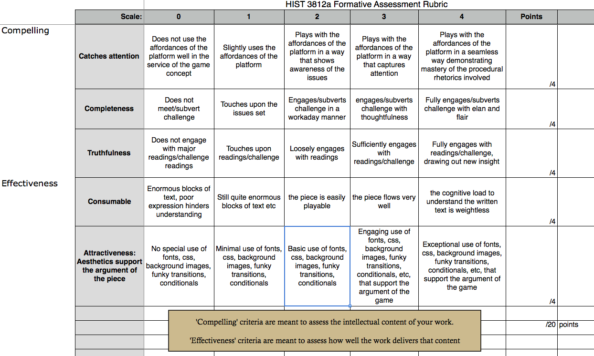

# Resources

### Some Twine games:

- [The Spanish Conquest Through The Eyes of Hernando Cortes](http://chadblack.net/cortes.html) built by students in Chad Black's university class on the Spanish Conquest of the Americas ([see his blog](https://parezcoydigo.wordpress.com/2013/05/28/chose-your-own-conquest/))
- [Moctezuma's Story](http://chadblack.net/moctezuma.html) from the same class
- [Beneath Floes](www.bravemule.com/beneathfloes)
- [Grail to the Chief](http://www.foralltoplay.com/prototype/#27.5.1b) This game uses audio in an extremely effective way. See Anastasia Salter's discussion of Twine in terms of [accessibility issues](http://chronicle.com/blogs/profhacker/making-accessible-games-with-twine-audio/60143)
- I used Twine to build a playable syllabus for my third-year course, [HIST3812a: Video Games and Simulations for Historians](http://philome.la/electricarchaeo/hist3812a-videogames-for-historians/play) at [Carleton University](http://carleton.ca).

### Tutorials:

+ [Anna Anthropy's Twine tutorial](http://www.auntiepixelante.com/twine/). This was written for an earlier version of Twine (which is still available to use from the main Twine website) but is still an important first port-of-call because all of the issues discussed still apply.
+ The [Twine Forums](http://twinery.org/forum/). You can often find what you're looking for here if you search - and read - carefully.
+ [Glorious Trainwrecks](https://www.google.ca/search?q=glorious+trainwrecks+twine&oq=glorious+trainwrecks+twine&aqs=chrome..69i57.4222j0j4&sourceid=chrome&es_sm=91&ie=UTF-8). You have to search this site to find the nuggets; the link is to a search that will get you started.
+ [Twine Cheat Sheet](http://gamesaslit.textories.com/syllabus/twine-cheat-sheet/). Remember - you mark off links with double [ [ and ] ] and you mark off code with < < and > > in Twine.
+ My own [tutorial on using Twine to create location-based augmented reality story telling](https://github.com/shawngraham/ar-archaeology/blob/master/workshop%20materials/Hacking%20Twine%20to%20make%20a%20location-based%20game.md). I just provide this out of interest.

### Rubric for grading Twine

Below I have included the rubric I use for grading history written in Twine. This will give you a sense of what we look for in this kind of experience.

