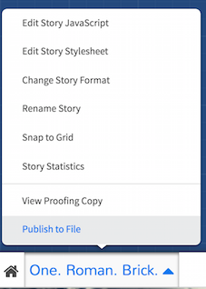

# NCHD Plan

## Play
+ Action Castle
  + What did you learn?
    + how to play the game
+ Aliens vs Vampires
  + What did you learn?
    + emergent storytelling
## Think
+ [Narrative Design Tips](http://gamasutra.com/blogs/DavidKuelz/20160418/270698/Narrative_Design_Tips_I_Wish_Id_Known.php)
  + **tip 1: 'story starts with gameplay'**
    + what can the player _do_?
    + what are the _verbs_ of the game?
  + **tip 2: 'story isn't the words'**
    + every aspect of the game is story
    + every aspect can move the story forward
  + **tip 3: 'writing is a form of feedback'**
    + player does something; the writing reacts to the player
  + **tip 4: 'focus on environments, not sequences'**
    + "a video game isn't necessarily a sequence of anything - it's an environment, and inside that environment the player can do whatever they want as long as they abide by the rules of the game."

## Do
+ [Twine](http://twinery.org) is a tool for creating worlds; if you've ever written a story, you already know how to use it.
+ Select [a great unsolved mystery in Canadian history](http://canadianmysteries.ca/en/index.php). The website will include all of the source materials you'll need. Your challenge: **explore this mystery using the _affordances_ of Twine to create a compelling interactive world**
  + for instance, you might decide that the player is in the role of an investigator in Montreal trying to interview witnesses to the [Redpath Murders](http://canadianmysteries.ca/en/index.php). Use the words, images, maps, newspaper clippings, and so on to create a first-person exploration!

## How?
+ At [Twine's website](http://twinery.org) click on the 'use it online' button. This will take you to where you can create new stories or access existing ones.
+ Click on the great big  button to get started. The screen shifts to a blue-print mode, with a single 'passage' in the centre of the screen.
+ Twine saves automatically in your browser. As long as you don't clear your browser's cache, your game will always be available. **Nevertheless** you should periodically export to html by clicking on the 'publish to file' link (which will let you save your game as a self-contained .html file):

+ Double-click on the passage. Begin writing text to describe your ideal user's first interaction with your application. You use double `[[` and `]]` to mark text that describes some kind of choice. For instance,
<br>

> The cows are in the field. Do you try to [[tip them over]]?

This will create a new passage called 'tip them over'.
+ Sometimes, you can achieve interesting effects by changing the way words are displayed (rather than moving to a new passage).

> There is a small dish of water. (click: "dish")[Your finger gets wet.]

another example:

> (link-reveal: "Heart")[broken]

another:

> (transition: "pulse")[Gleep!]

+ Images can be added using standard html:

> ```

+ As can audio:

> `<audio src="http://domainname/foldername/audioname.mp3" autoplay></audio>`

_(there are other ways of doing images and audio, but these will suffice for now)_
